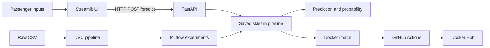

# AirlineSense

**Predict passenger satisfaction before the complaint.**

AirlineSense is a small end-to-end ML product that predicts whether a passenger will be satisfied from passenger, journey, and service ratings. A Streamlit interface sends a real HTTP request to FastAPI. FastAPI validates the request and uses the same saved sklearn pipeline that was fitted during training.

## Verified result

The selected Random Forest achieved the following results on the untouched 20% test set (25,976 passengers):

| Metric | Result |
|---|---:|
| Accuracy | 96.0% |
| Precision | 96.0% |
| Recall | 94.7% |
| F1 | 95.4% |
| ROC-AUC | 0.994 |

The model supports prioritization and service recovery. It should not be treated as a causal model or used to deny service.

## Product flow



## Dataset status

The supplied Maven Analytics Airline Passenger Satisfaction dataset contains 129,880 rows and 24 columns.

- Target: `Satisfaction`
- Class split: 73,452 Neutral or Dissatisfied, 56,428 Satisfied
- Missing values: 393 values in `Arrival Delay`
- Duplicates: none
- Leakage control: unique `ID` excluded; transformations fit only on training folds
- Status: **READY WITH FIXABLE ISSUES**

Arrival delay is median-imputed inside the fitted pipeline. The raw data is tracked by DVC and excluded from Git.

## Model experiments

| Experiment | Feature set | CV F1 | CV ROC-AUC | Decision |
|---|---|---:|---:|---|
| Logistic Regression | Baseline | 0.850 | 0.926 | Useful interpretable baseline |
| Random Forest | Baseline | **0.952** | **0.993** | Selected |
| Random Forest | Engineered | 0.951 | 0.993 | Extra features did not improve F1 |

The engineered model added total delay, average service score, digital experience score, delay per 1,000 miles, and a delay flag. The baseline Random Forest performed slightly better, so the production model keeps the simpler feature set. This avoids carrying transformations that add complexity without evidence of benefit.

## Repository structure

```text
app/api/                 FastAPI service and request schemas
app/streamlit/           Product interface
src/data/                Loading and schema validation
src/features/            Reusable feature transformer
src/models/              sklearn pipeline builders
scripts/                 DVC stages and service launcher
tests/                   Feature, model, and API tests
models/                  Production pipeline and metadata
reports/                 Real experiment and test results
docs/                    Decisions, demo, and presentation notes
.github/workflows/       CI and Docker Hub publishing
```

## Local setup

Python 3.12 is recommended.

```bash
python3.12 -m venv .venv
source .venv/bin/activate
python -m pip install -r requirements.txt
```

## Reproduce data and training

The included DVC remote is local and intended for classroom demonstration. On the original development machine:

```bash
export DVC_SITE_CACHE_DIR=/tmp/airlinesense-dvc-site-cache
dvc pull
dvc repro
dvc metrics show
dvc plots show
```

Without DVC, the individual commands are:

```bash
python scripts/prepare_data.py
python scripts/build_features.py
python scripts/train.py
python scripts/evaluate.py
```

## MLflow

Training creates four real runs: three cross-validated candidates and one registered production candidate. The registered model is `AirlineSenseClassifier`, version 1 in the local SQLite registry.

```bash
mlflow server \
  --backend-store-uri sqlite:///mlflow.db \
  --default-artifact-root ./mlruns \
  --host 127.0.0.1 \
  --port 5000
```

Open `http://localhost:5000` and compare F1, ROC-AUC, recall, and run parameters.

## Run the product

Terminal 1:

```bash
uvicorn app.api.main:app --host 0.0.0.0 --port 8000
```

Terminal 2:

```bash
AIRLINESENSE_API_URL=http://localhost:8000 \
streamlit run app/streamlit/app.py --server.port 8501
```

- Streamlit: `http://localhost:8501`
- API docs: `http://localhost:8000/docs`
- Health check: `http://localhost:8000/health`

## API example

```bash
curl -X POST http://localhost:8000/predict \
  -H "Content-Type: application/json" \
  -d '{
    "gender":"Female", "age":35, "customer_type":"Returning",
    "type_of_travel":"Business", "travel_class":"Business",
    "flight_distance":821, "departure_delay":26, "arrival_delay":39,
    "departure_arrival_convenience":2, "ease_of_online_booking":2,
    "checkin_service":3, "online_boarding":5, "gate_location":2,
    "onboard_service":5, "seat_comfort":4, "leg_room_service":5,
    "cleanliness":5, "food_and_drink":3, "inflight_service":5,
    "inflight_wifi_service":2, "inflight_entertainment":5,
    "baggage_handling":5
  }'
```

## Tests

```bash
pytest -q
```

Verified locally: **9 passed**.

## Docker

```bash
docker build -t airlinesense-mlops:local .
docker run --rm -p 8000:8000 -p 8501:8501 airlinesense-mlops:local
```

The image starts FastAPI and Streamlit, exposes ports 8000 and 8501, and includes an API health check. The local image was built and the container returned a real model prediction.

## GitHub Actions and Docker Hub

`ci.yml` runs the test suite on pushes and pull requests. `docker-publish.yml` builds on GitHub-hosted infrastructure and publishes these tags:

- `latest` from the default branch
- `sha-<commit>` for traceability
- Git tags such as `v1.0.0`

Create a Docker Hub repository named `airlinesense-mlops`, then add these GitHub repository secrets:

- `DOCKERHUB_USERNAME`
- `DOCKERHUB_TOKEN` (a Docker Hub access token, never the account password)

## Limitations

- The dataset contains post-flight survey ratings, so the prediction is most useful before a complaint or service-recovery decision, not before the flight begins.
- Satisfaction patterns may drift by airline, route, season, and survey design.
- The current probability threshold is 0.50 and should be tuned against the cost of missed dissatisfied passengers.
- Cloud deployment is intentionally left as an optional extension after the mandatory local chain is stable.

See [PROJECT_DECISIONS.md](docs/PROJECT_DECISIONS.md), [PRESENTATION_SCRIPT.md](docs/PRESENTATION_SCRIPT.md), [DEMO_SCRIPT.md](docs/DEMO_SCRIPT.md), [PRESENTATION.md](docs/PRESENTATION.md), and [SUBMISSION_CHECKLIST.md](docs/SUBMISSION_CHECKLIST.md).
