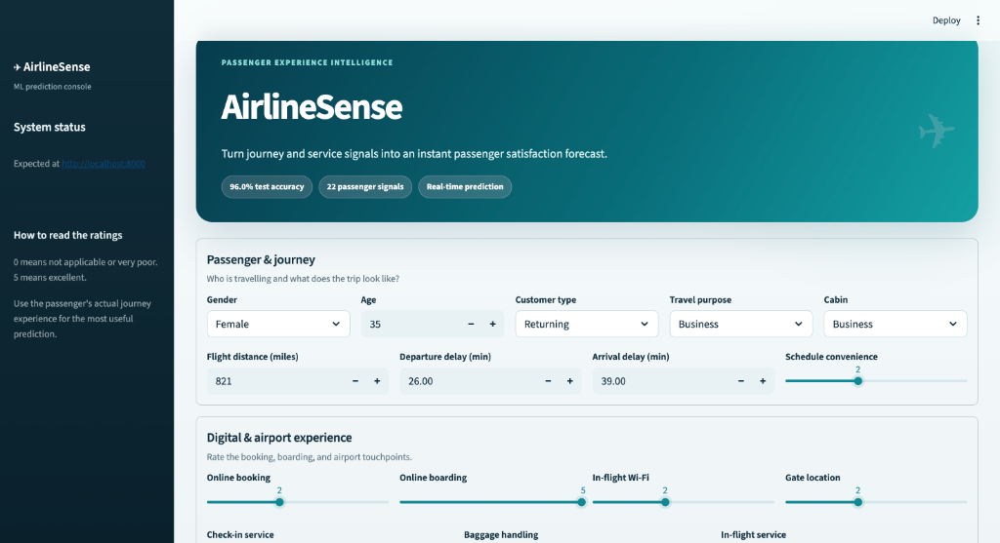
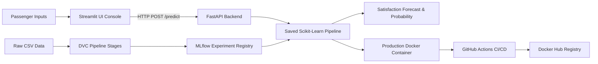

# ✈️ AirlineSense

> **Predict passenger satisfaction before the complaint.**

[](https://www.python.org/)
[](https://fastapi.tiangolo.com/)
[](https://streamlit.io/)
[](https://mlflow.org/)
[](https://dvc.org/)
[](https://www.docker.com/)
[]()
[]()

AirlineSense is an end-to-end Machine Learning product that forecasts passenger satisfaction from flight details, journey attributes, and service touchpoint ratings. It serves real-time predictions via a FastAPI backend connected to an intuitive, interactive Streamlit UI console.

---

## 🎨 Product Interface

Below is the live **AirlineSense** prediction dashboard, allowing operations teams to input journey metrics and instantly analyze passenger experience predictions:



---

## 🎯 Verified Performance Results

The production **Random Forest** model was evaluated on an untouched 20% test set (25,976 passengers):

| Metric | Test Result | Target Alignment |
|---|---:|---|
| **Accuracy** | **96.0%** | Overall correct predictions |
| **Precision** | **96.0%** | Minimizes false positive satisfaction flags |
| **Recall** | **94.7%** | High coverage of dissatisfied passengers |
| **F1 Score** | **95.4%** | Balanced harmonic score |
| **ROC-AUC** | **0.994** | Outstanding class separability |

> ⚠️ **Usage Note**: The model is designed for passenger experience prioritization and service recovery dispatch. It should not be used for automated service denial.

---

## 🔄 End-to-End MLOps Architecture



---

## 📊 Dataset & Feature Engineering

Based on the **Maven Analytics Airline Passenger Satisfaction** dataset:
- **Total Records**: 129,880 rows, 24 attributes
- **Target Distribution**: 73,452 Neutral/Dissatisfied (56.5%) vs 56,428 Satisfied (43.5%)
- **Data Quality**: 393 missing values in `Arrival Delay` median-imputed inside the fitted Scikit-Learn pipeline
- **Leakage Prevention**: Unique `ID` excluded; all encoders and imputers fit strictly on training folds

### Model Experiment Benchmarks

| Experiment | Feature Set | CV F1 | CV ROC-AUC | Outcome / Decision |
|---|---|---:|---:|---|
| Logistic Regression | Baseline | 0.850 | 0.926 | Interpretable linear baseline |
| **Random Forest** | **Baseline** | **0.952** | **0.993** | **Selected Production Model** |
| Random Forest | Engineered | 0.951 | 0.993 | Extra features added no evidence |

---

## 📁 Repository Structure

```text
├── app/
│   ├── api/             # FastAPI backend service & request schemas
│   └── streamlit/       # Streamlit interactive UI application
├── src/
│   ├── data/            # Data loading, validation, and schema definitions
│   ├── features/        # Feature transformers and pipelines
│   └── models/          # Scikit-Learn pipeline builders and evaluators
├── scripts/             # DVC pipeline stages and service runners
├── tests/               # Unit and integration test suite (pytest)
├── models/              # Saved model pipelines and metadata
├── reports/             # Generated metrics, confusion matrices, and figures
├── docs/                # Architecture decisions, pitch deck, and scripts
└── .github/workflows/   # CI/CD workflows for testing and Docker Hub deployment
```

---

## 🚀 Quickstart & Local Setup

### Prerequisites
- Python **3.12+**
- Git & Make (optional)

### 1. Environment Setup
```bash
# Clone the repository
git clone https://github.com/itsparsh10/AirlineSense.git
cd AirlineSense

# Create virtual environment
python3.12 -m venv .venv
source .venv/bin/activate  # On Windows: .venv\Scripts\activate

# Install dependencies
pip install -r requirements.txt
```

### 2. Run the Application Services

Using Makefile commands:
```bash
# Start FastAPI backend (Port 8000)
make api

# Start Streamlit frontend UI (Port 8501)
make ui
```

Or start manually in separate terminal windows:
```bash
# Terminal 1: API Backend
python -m uvicorn app.api.main:app --host 0.0.0.0 --port 8000 --reload

# Terminal 2: Web UI
AIRLINESENSE_API_URL=http://localhost:8000 streamlit run app/streamlit/app.py --server.port 8501
```

Access points:
- **Streamlit Web UI**: [http://localhost:8501](http://localhost:8501)
- **FastAPI OpenAPI Specs**: [http://localhost:8000/docs](http://localhost:8000/docs)
- **API Health Check**: [http://localhost:8000/health](http://localhost:8000/health)

---

## 📡 API Usage Example

Send a prediction payload directly to the FastAPI REST endpoint:

```bash
curl -X POST http://localhost:8000/predict \
  -H "Content-Type: application/json" \
  -d '{
    "gender": "Female",
    "age": 35,
    "customer_type": "Returning",
    "type_of_travel": "Business",
    "travel_class": "Business",
    "flight_distance": 821,
    "departure_delay": 26,
    "arrival_delay": 39,
    "departure_arrival_convenience": 2,
    "ease_of_online_booking": 2,
    "checkin_service": 3,
    "online_boarding": 5,
    "gate_location": 2,
    "onboard_service": 5,
    "seat_comfort": 4,
    "leg_room_service": 5,
    "cleanliness": 5,
    "food_and_drink": 3,
    "inflight_service": 5,
    "inflight_wifi_service": 2,
    "inflight_entertainment": 5,
    "baggage_handling": 5
  }'
```

---

## 🧪 Testing & Verification

Run the automated test suite covering API contracts, data validation, and model inference:

```bash
pytest -q
```
*Expected Output*: `9 passed`

---

## 🐳 Docker Deployment

Build and launch the complete production environment using Docker Compose:

```bash
# Copy sample environment configuration
cp .env.example .env

# Build and start services
docker compose up --build -d

# Verify container status
docker compose ps
curl http://127.0.0.1:8000/health
```

---

## 🛠️ Experiment Tracking with MLflow & DVC

To inspect experiment runs and model metadata:

```bash
# Launch MLflow tracking server
mlflow server \
  --backend-store-uri sqlite:///mlflow.db \
  --default-artifact-root ./mlruns \
  --host 127.0.0.1 \
  --port 5000
```
Open [http://localhost:5000](http://localhost:5000) to view metrics, parameters, and model artifacts.

---

## 📄 License & Attribution

Developed as an open-source Machine Learning & MLOps project for passenger satisfaction intelligence.
